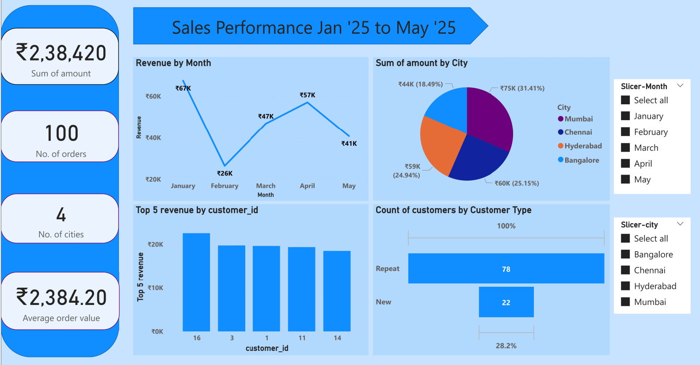

# Sales Performance Dashboard

# Objective:
Analyse a sample store data to understand Revenue trends, customer behaviour, and Business performance.

# Dataset:
Contains:
- Orders
- Customers
- Products
- Amounts
 
# Insights
- Revenue peaked in January (~₹67K)
- Mumbai contributes highest revenue (~31%)
- 78% customers are repeat customers

 # Tools used:
 - SQL
 - Power BI
 - Excel
 - Github

# Dashboard

 
#Dashboard File
[Download Dashboard](Dashboard-Sales%20Performance%2005%20May.pdf)
